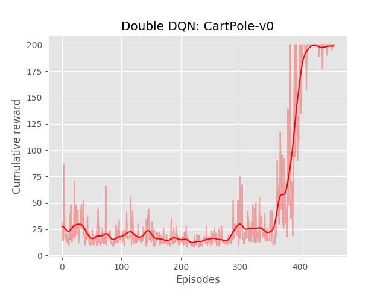
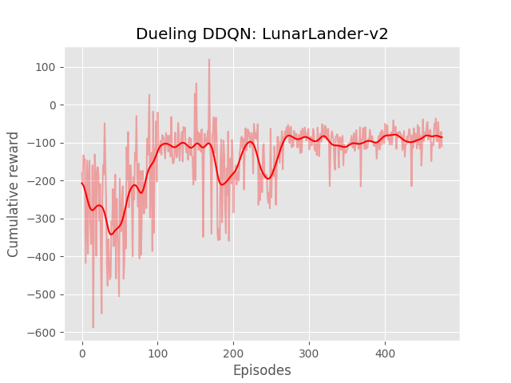
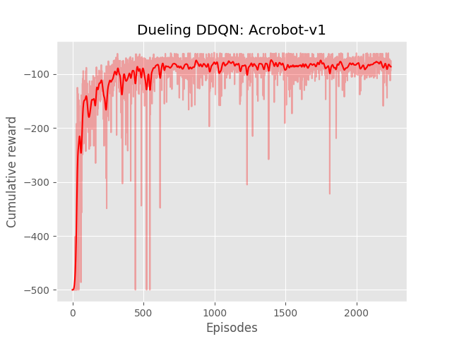

#Dueling Double Deep Q-Learning 

This repo holds an implementation of a PyTorch version of Dueling Double Deep Q-Learning. It is based on my other repo for Double DQN: https://github.com/mome36/DoubleDQN


## How to use: 

To train an agent, run: 

```bash
python dueling_dqn.py --env LunarLander-v2
```

To see the agent perform: 
```bash
python enjoy.py --env LunarLander-v2
```

## Performances





